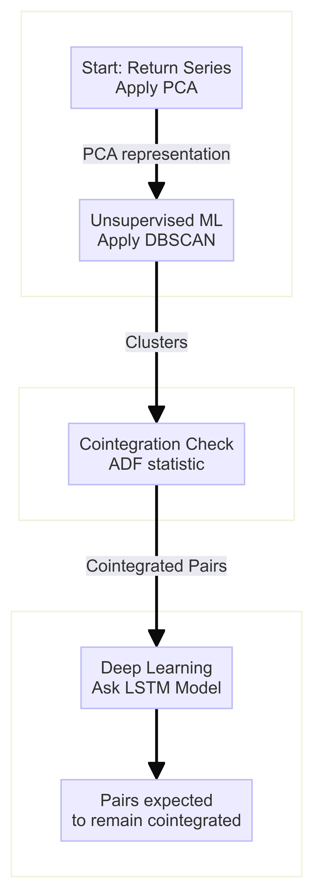

# Pairs Trading with Deep Learning

## Overview
This capstone project aims to enhance pairs trading strategies by using deep learning techniques, specifically a deep-LSTM architecture. Pairs trading is a market-neutral strategy that profits from the deviation between two historically co-integrated assets. The goal is to predict the cointegration of asset pairs in future periods, improving the accuracy and reliability of pair selection for trading.

## Objective
To develop a predictive model that identifies asset pairs likely to remain co-integrated in the future, thereby facilitating more profitable and less risky trading decisions.

## Proposed Framework
The following diagram illustrates the proposed pair trading framework, outlining the process from data collection to trading execution:

  

## Methodology
1. **Data Preprocessing:** Standardize and clean historical financial data to ensure model accuracy.
2. **Pair Selection:**
   - Use DBSCAN for clustering similar stocks based on historical price movements.
   - Apply statistical tests to identify potential co-integrated pairs within clusters.
3. **Model Implementation:**
   - **LSTM-Based Predictor:** Predicts future hedge ratios and the likelihood of continued cointegration.
   - **LSTM-Based Classifier:** Classifies whether pairs will remain stationary over the next trading period.

## Conclusion
This project successfully enhanced pairs trading strategies using LSTM models, achieving robust results that surpassed benchmarks. The models effectively predicted cointegration for more accurate pair selections and profitable trading decisions. The project faces limitations including dependency on extensive historical data, sensitivity to market volatility, and high computational demands. Future efforts should focus on integrating real-time data analysis, exploring more scalable model architectures, and enhancing the model

## Code

## How to Use
Use Solution Design Document.pdf in this repo at https://github.com/Vorlde/Pairs_trading-Capstone/blob/main/Solution%20Design%20Document.pdf 

## Contributors
- Himanshu Kumar

## Acknowledgments
Special thanks to WorldQuant University, Dean Gabriella Maiello, Professor Tiberiu Stoica, and all who supported this project.

## License
Standard MIT License
