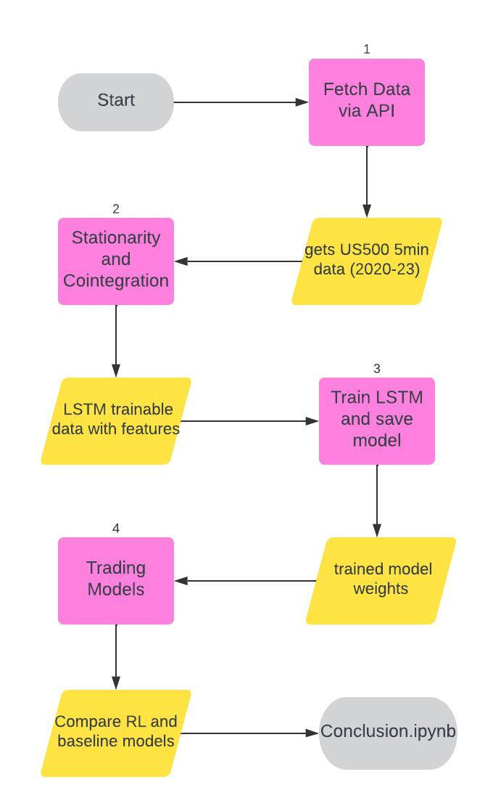

# Pairs_trading-Reinforcement-Learning
Pairs trading via Reinforcement Learning

This project explores pairs trading strategies through reinforcement learning.

## Capstone Flow
Below is the flowchart for the capstone project:

  

## Usage
To run this project, follow these steps:
1. ...
2. ...
